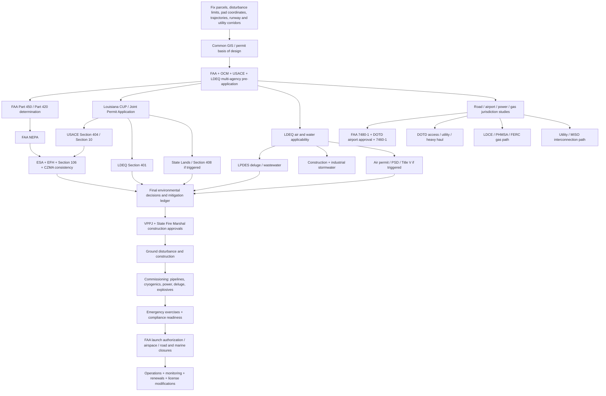

# Starbase Louisiana Permitting Roadmap: Federal, Louisiana, Vermilion Parish, and Starbase Texas Precedent

## Executive summary

A Starbase-scale launch complex on or near Pecan Island is not a project with a single “spaceport permit.” It is a coordinated program of federal launch licensing, federal environmental review, coastal and wetlands authorization, water and air permitting, road and airport approvals, pipeline and cryogenic-systems regulation, explosives licensing, power-system approvals, parish construction and floodplain permits, and long-term operational compliance. Louisiana now refers to the former Department of Natural Resources organization on current state pages as the **Louisiana Department of Conservation and Energy**; many legacy permitting pages and URLs still use DNR/LDENR branding. citeturn18search2turn19search2

Public reporting on August 25, 2026 described SpaceX’s announced “Starbase Louisiana” concept as a roughly 125,000-acre Pecan Island-area project with launch, methane-production, power-generation, marine-shipping and possible airport infrastructure. Those reports do **not** substitute for surveyed parcel boundaries, launch-pad coordinates, runway coordinates, launch azimuths, wetland limits, pipeline routes, dredging footprints, outfall locations or utility routes. Until those are fixed, the permit inventory below should be treated as a **regulatory screening and critical-path roadmap**, not a final jurisdictional determination. citeturn25news36

The highest-risk permitting issue is the interaction between a greenfield launch complex and Louisiana’s coastal wetland regime. Louisiana requires a Coastal Use Permit for a broad range of dredging, filling, industrial development, water-control structures and similar uses in the coastal zone. In the Louisiana coastal zone, the state Joint Permit Application is also the principal gateway into U.S. Army Corps of Engineers Section 404/Section 10 review. Vermilion Parish is **not** among the parishes listed by Louisiana as having an approved Local Coastal Management Program, so the state Office of Coastal Management should be treated as the primary CUP decision-maker for an assumed Pecan Island site unless the institutional framework changes. citeturn3view0turn3view1turn15search0

For a project of this scale, a **Department of the Army individual permit** should be the planning assumption wherever permanent wetland fill, dredging, shoreline conversion or new channels are substantial; a nationwide/general permit should not be assumed. The Corps evaluates individual Section 404 projects under the Section 404(b)(1) alternatives framework, normally provides a public-notice period of up to about 30 days, and requires applicable Louisiana Coastal Use Permit, Section 401 water-quality certification and compensatory mitigation before authorization can be completed. The New Orleans District currently charges $100 for a commercial individual Department of the Army permit after authorization; that nominal federal fee is insignificant compared with delineation, alternatives analysis, mitigation credits, engineering and monitoring costs. citeturn3view2turn15search0turn15search9

The second major critical path is the **FAA commercial-space license and its environmental review**. A Starship-equivalent vehicle would require FAA Office of Commercial Space Transportation authorization under the current Part 450 vehicle-operator regime. FAA’s process begins with concept-of-operations and pre-application consultation; environmental review, safety analysis, airspace coordination, policy/payload review and financial-responsibility work proceed before and during formal application. Once FAA accepts a sufficiently complete license application, the statutory evaluation period is generally 180 days, but substantial environmental and pre-application work occurs outside that clock. A separate Part 420 launch-site operator license should be resolved explicitly with FAA during pre-application; its applicability depends on how the site is owned, operated and offered for launch use. citeturn10search0turn10search2turn10search6

For project planning, **treat Starbase Louisiana as potentially EIS-level until FAA determines otherwise**. That is an inference, not a predetermined legal outcome. It is supported by the combination of the scale and sensitivity of the reported Louisiana project and the fact that FAA completed a full EIS and Record of Decision for SpaceX’s original Boca Chica launch-site proposal in 2014, followed by a new programmatic EA/FONSI for Starship/Super Heavy in 2022 and additional tiered environmental reviews as operations evolved. citeturn23search2turn23search0turn25news36

Water management deserves its own permitting workstream. Construction disturbing five acres or more falls under Louisiana’s large-construction stormwater general permit, currently LAR100000 for the October 1, 2024–September 30, 2029 term; LDEQ states that a complete large-construction NOI is self-implementing after the required waiting period, while the SWPPP must already exist. Smaller qualifying construction uses LAR200000. Separately, deluge water, washdown water, cooling-water streams or process wastewater discharged to jurisdictional waters may require an individual LPDES permit rather than merely construction stormwater coverage. Individual LPDES permits receive at least 30 days of public notice, and Louisiana describes a nominal “300-day rule” for permit processing that excludes certain deficiency, EPA-review and public-comment periods. citeturn3view4turn3view5turn0search8

The Texas deluge experience is an important warning. SpaceX ultimately sought a Texas Pollutant Discharge Elimination System authorization for Starbase deluge/washdown/stormwater discharges after controversy over earlier operation of the system; Texas regulators approved the permit in February 2025. Louisiana should avoid repeating that sequence: **characterize the deluge discharge and secure the correct LPDES path before first wet commissioning or launch use**, rather than treating a high-volume deluge system as an incidental component of a launch pad. citeturn25search29turn25search8

Several other permitting families are conditional rather than automatically applicable. FERC jurisdiction over natural-gas infrastructure depends on whether pipelines are interstate or whether the facility is a jurisdictional LNG import/export terminal; PHMSA Part 193 applies to LNG facilities used in pipeline transportation but expressly excludes LNG facilities used by ultimate consumers in specified circumstances. A facility producing or liquefying methane solely for its own rocket-fuel consumption therefore needs an early written jurisdictional determination rather than an assumption that a conventional LNG-terminal regime does or does not apply. citeturn18search0turn18search4turn18search8

Similarly, there is no single Louisiana “power-plant permit.” A large onsite generating plant would combine LDEQ air authorization, possibly LPDES/cooling-water requirements, coastal/wetland permits, fire/building permits, spill plans, and utility/transmission studies. MISO generator interconnection becomes relevant if generation is interconnected to and exporting into the transmission system; a primarily importing large load follows the serving utility’s large-load/interconnection process instead. citeturn13search1turn13search2

The practical critical path therefore is:

**parcel/launch-envelope definition → FAA/OCM/USACE/LDEQ pre-application → NEPA and biological/cultural consultations in parallel with CUP/404/401 → air/water/pipeline/power/airport design permits → mitigation and land/water-bottom rights → parish/fire/floodplain construction permits → construction → commissioning → FAA operational licensing, emergency-response readiness and recurring compliance.**

No publicly indexed prior “deep-research session” matching this exact Starbase Louisiana permit inventory was located in the searches reviewed. The best public precedent set is instead the official FAA Boca Chica EIS/Starship environmental archive, Texas environmental permit records, and Louisiana/USACE application guidance cited throughout this report. citeturn23search2turn23search14turn24search1

## Site baseline and Louisiana-specific constraints

The first deliverable should not be a permit application. It should be a **single controlled GIS/design basis** used by every agency. FAA, OCM, USACE, LDEQ, LDWF, SHPO, State Lands, DOTD and parish reviewers should all receive the same parcel boundary, proposed disturbance footprint, utility corridors, dredge footprint, launch azimuths and alternatives.

At minimum, that common data package should contain surveyed property and easement boundaries; all proposed launch pads and exclusion zones; production and vehicle-processing buildings; methane and oxygen plants and storage; generation and substation sites; transmission and pipeline corridors; access roads and bridge/culvert work; proposed runway and approach surfaces; shoreline work; dredging and dredged-material placement areas; intake/outfall locations; wetland delineations; flood elevations; topography and bathymetry; and proposed construction phases. This level of definition is necessary because both Corps permit jurisdiction and FAA environmental effects are tied to the actual project footprint and action area rather than merely the applicant’s property line. citeturn15search0turn16search19turn10search2

**Coastal jurisdiction is a first-order constraint.** Louisiana’s Coastal Use Permit program expressly covers dredging/fill, water-control structures, bulkheads, industrial and commercial development and related coastal uses. The state encourages pre-application consultation and can organize an interagency pre-application meeting/site visit when given advance notice. For a Starbase-scale application, that option should be used before engineering reaches 30% design. citeturn3view0

**Vermilion Parish does not currently appear on Louisiana’s official list of approved parish Local Coastal Management Programs.** That means the project should not be modeled on a parish-issued CUP process such as might exist elsewhere in coastal Louisiana; state OCM review is the appropriate baseline. The parish still retains building, floodplain, public-works and other local authority. citeturn3view1turn22search0

**Wetlands and navigable waters will drive layout optimization.** In the coastal zone, Louisiana’s Joint Permit Application is used for coordinated state/Corps review. The Corps New Orleans District evaluates work under Section 404 of the Clean Water Act and, where applicable, Section 10 of the Rivers and Harbors Act. Avoidance and minimization should therefore occur while site layout alternatives remain genuinely available; attempting to justify a preselected maximum-wetland-impact footprint late in design creates the greatest Section 404(b)(1) risk. citeturn15search0turn3view2

**Coastal protection work is not automatically exempt because it is called “restoration.”** A private shoreline, levee, breakwater, marsh-fill, navigation-channel or dredged-material project can itself require CUP, Corps authorization, Section 401 certification and State Lands rights. Where work would alter, cross, occupy or affect a Corps Civil Works project, Section 408 permission is additionally required; USACE specifically gives road/utility crossings, navigation-channel dredging and drainage improvements as examples. citeturn15search2turn15search3

CPRA should be an early coordination participant even where it is not the permit issuer. Louisiana’s Coastal Master Plan is explicitly designed to identify interactions, overlaps and conflicts among coastal protection and restoration projects. A launch complex should be screened against existing and planned restoration, shoreline, sediment, levee and risk-reduction investments before permanent infrastructure is fixed. citeturn19search1turn19search12

**State-owned water bottoms require a property-rights workstream separate from environmental permitting.** Louisiana’s Office of State Lands issues rights-of-way, surface/subsurface agreements and water-bottom permits/leases; its current Forms & Procedures page provides water-bottom permit forms and lease checklists. A Corps permit or CUP does not itself confer a proprietary right to occupy state property. citeturn19search0turn19search3

**Floodplain and hurricane design will be a parish construction issue as well as an engineering issue.** Vermilion Parish’s Permit Department reviews plans, issues building permits and conducts inspections; its current page specifically directs applicants to FEMA flood mapping and provides commercial-construction and elevation requirements. Pecan Island-area development should therefore carry flood-zone, elevation-certificate and coastal high-hazard design assumptions into the site basis rather than treating them as end-stage building-permit paperwork. citeturn22search0

The parish page does not identify a general parish-wide industrial zoning approval comparable to the zoning regimes of some metropolitan parishes. Accordingly, **do not assume either that zoning approval is required or that the site is “unzoned.”** Obtain a written parcel-specific land-use, setback, subdivision and special-district determination from the Vermilion Parish Police Jury after parcels are fixed; add municipal approvals only if any project element is later found inside an incorporated municipality. citeturn22search0turn22search15

Finally, environmental studies must evaluate an **action area**, not just the fence line. USFWS IPaC provides an official species list and consultation materials for ESA Section 7; NOAA Fisheries conducts ESA and Essential Fish Habitat consultations for marine/coastal effects; LDWF maintains its own rare-species and natural-community project-review process; and Louisiana SHPO provides the state portal for National Historic Preservation Act review. citeturn16search0turn16search1turn16search3turn16search2

## Comprehensive permit inventory

The table uses **Core** for approvals that should be assumed in the baseline program, **Triggered** for approvals whose applicability depends on final design/jurisdiction, and **Plan** for mandatory compliance programs that are not themselves construction permits. “Typical timeline” is either an official clock where one exists or a conservative planning range; a planning range is not an agency commitment.

### Federal and multi-agency approvals

| Priority | Permit / regulatory action | Issuing or lead agency; official application entry point | Form / principal submission | Timeline and fee planning | Principal authority |
|---|---|---|---|---|---|
| **Core** | Starship-equivalent launch/reentry operations | FAA Office of Commercial Space Transportation; **Getting Started** and **Part 450 application checklist**. citeturn10search0turn10search2 | Part 450 incremental application: CONOPS, safety organization, system safety, flight-safety analysis, environmental information, policy/payload and financial-responsibility materials | FAA identifies a **180-day evaluation period after acceptance of a sufficiently complete license application**; pre-application/NEPA is additional. Fee not stated as a conventional application fee on the licensing guidance; insurance/MPL is separate. citeturn10search0turn10search10 | 51 U.S.C. ch. 509; 14 CFR pts. 413, 450; Part 440 financial responsibility |
| **Triggered** | Launch-site operator license | FAA AST | Part 420 launch-site operator application/checklist; determine applicability with FAA during pre-application. citeturn9search8turn10search0 | Site-specific; coordinate concurrently with vehicle license and environmental review | 14 CFR pt. 420 |
| **Core** | FAA environmental review | FAA as lead federal agency for launch license | Applicant environmental information sufficient for NEPA; FAA prepares appropriate environmental document | No single licensing-clock substitute for NEPA; complex greenfield coastal project should plan for a potentially multi-year review | NEPA, 42 U.S.C. §4321 et seq.; FAA environmental procedures. FAA confirms launch licensing is a federal action requiring environmental review. citeturn23search13turn23search8 |
| **Core** | Financial responsibility / maximum probable loss | FAA | Part 440 information and insurance/financial-responsibility demonstration | Parallel with licensing; amount project-specific | 14 CFR pt. 440. citeturn10search10 |
| **Core** | Section 404 wetland/fill permit and Section 10 navigable-water permit | USACE New Orleans District; **Permits** / **Regulatory Request System**. citeturn15search0turn15search9 | Within coastal zone, Louisiana Joint Permit Application; drawings, purpose/need, quantities, alternatives, mitigation information | Individual permit public notice normally about 30 days; total review is project-specific and can extend many months. Commercial individual-permit fee: **$100**. citeturn3view2 | CWA §404, 33 U.S.C. §1344; Rivers and Harbors Act §10, 33 U.S.C. §403; 33 CFR pts. 320–332 |
| **Triggered** | Section 408 permission | USACE New Orleans District | Section 408 request with engineering, environmental, real-estate and legal information | Start very early if crossing/altering federal flood-control, navigation or other Civil Works project; no simple fixed clock | 33 U.S.C. §408. citeturn15search2turn15search3 |
| **Core with 404/10** | Section 401 Water Quality Certification | LDEQ, coordinated with federal permit | Certification request/application supporting federal permit | Must be issued or waived before applicable federal license/permit; synchronize with Corps review | CWA §401, 33 U.S.C. §1341. citeturn15search1turn3view2 |
| **Core** | Coastal Zone Management Act federal consistency | Louisiana OCM with federal action agencies | Consistency certification/material embedded in federal/coastal review | Parallel with FAA/Corps federal authorization | CZMA §307, 16 U.S.C. §1456; La. R.S. 49:214.32 and Louisiana Coastal Resources Program |
| **Core** | ESA Section 7 consultation — terrestrial/freshwater species | FAA/USACE as action agencies; USFWS | **IPaC** official species list, biological analysis/assessment and consultation package | Informal or formal depending effect determination; begin survey planning before seasonal windows close | ESA §7, 16 U.S.C. §1536; 50 CFR pt. 402. IPaC generates the official species list and consultation materials. citeturn16search0turn16search4 |
| **Core if marine effects** | ESA consultation — marine species; Essential Fish Habitat | FAA/USACE with NOAA Fisheries Southeast Region | ESA consultation package; EFH assessment/recommendations | Parallel with NEPA/Corps; survey/modeling needs site-specific | ESA §7; Magnuson-Stevens Act §305(b), 16 U.S.C. §1855(b). citeturn16search5turn16search8 |
| **Triggered** | Marine Mammal Protection Act incidental take | NOAA Fisheries | Incidental Harassment Authorization or Letter of Authorization if launch, construction, pile driving, dredging or other effects meet take threshold | Often substantial lead time; determination requires acoustic/action-area analysis | MMPA, 16 U.S.C. §1371(a)(5) |
| **Core** | NHPA Section 106 / archaeological and historic-property review | FAA/USACE lead; Louisiana SHPO and consulting Tribes | Define Area of Potential Effects; records search, Phase I cultural survey and subsequent studies if needed | Parallel with NEPA; redesign/avoidance can materially shorten dispute resolution | NHPA §106, 54 U.S.C. §306108; 36 CFR pt. 800. Louisiana provides an official Section 106 project-submission function. citeturn16search2 |
| **Triggered** | Migratory bird/eagle permits | USFWS | MBTA/eagle permit where unavoidable regulated take is anticipated | Seasonal surveys commonly drive schedule; avoidance preferable | Migratory Bird Treaty Act; Bald and Golden Eagle Protection Act; 50 CFR pts. 21, 22 |
| **Core for airfield** | New airport/landing area notice | FAA Airports | **FAA Form 7480-1, Notice for Construction, Alteration and Deactivation of Airports** | Part 157 notice generally **at least 90 days before** covered construction/alteration | 14 CFR pt. 157. FAA’s current form page identifies Form 7480-1. citeturn9search2turn9search14 |
| **Core for towers/runway obstacles** | Obstruction evaluation | FAA OE/AAA | **FAA Form 7460-1, Notice of Proposed Construction or Alteration** | Generally file at least 45 days before construction where Part 77 notice is required; allow longer for major launch towers | 14 CFR pt. 77. Current FAA form listing confirms Form 7460-1. citeturn9search1turn9search14 |
| **Triggered** | Interstate natural-gas pipeline certificate | FERC | NGA Section 7(c) application, usually after extensive route/environmental development | Often multi-year for major greenfield infrastructure; no Starbase-specific fixed clock | NGA §7(c), 15 U.S.C. §717f(c). FERC reviews construction/operation of interstate gas pipelines. citeturn18search4 |
| **Triggered** | Jurisdictional LNG terminal authorization | FERC | NGA Section 3 application; pre-filing procedures for covered LNG projects | Major LNG review is potentially multi-year | NGA §3, 15 U.S.C. §717b; FERC identifies itself as reviewing LNG facilities subject to NGA §§3 and 7. citeturn18search0turn18search10 |
| **Triggered** | Pipeline/LNG safety jurisdiction | PHMSA | Operator filings and design/operations compliance; obtain jurisdictional interpretation early | Runs through design, construction and operations | 49 U.S.C. §60101 et seq.; 49 CFR pts. 192/193/195. PHMSA states Part 193 covers LNG facilities used in pipeline transportation and contains siting, design, construction, fire-protection, operation and security standards. citeturn18search1 |
| **Triggered** | Ocean disposal of dredged material | USACE/EPA | MPRSA Section 103 permit/analysis if dredged material would be disposed at sea rather than beneficially placed/onshore | Integrate with dredging permit; testing can be lengthy | Marine Protection, Research and Sanctuaries Act §103, 33 U.S.C. §1413 |
| **Triggered** | Bridge over navigable water | U.S. Coast Guard | Bridge permit if a new bridge/causeway crosses navigable water | Site-specific federal environmental and navigation review | General Bridge Act / Rivers and Harbors authorities; 33 CFR pts. 114–115 |
| **Triggered** | Marine terminal / port security and navigation | USCG | Facility-security approvals and navigation-safety coordination if regulated waterfront facility; Waterway Suitability Assessment for jurisdictional LNG marine traffic | Begin during port concept design | 33 CFR pt. 105 and applicable port-security rules; PHMSA notes Coast Guard authority over LNG vessels/marine transfer and Waterway Suitability Assessments. citeturn18search11 |
| **Triggered** | Federal explosives license/permit and storage | ATF | Federal explosives licensing process plus compliant magazines and records | Allow for background review and magazine inspection; fee varies by license/permit class | 18 U.S.C. ch. 40; 27 CFR pt. 555. ATF regulations require licensing/permit approval and prescribe storage/record requirements. citeturn17search8turn17search16turn17search36 |
| **Plan** | EPA Risk Management Program | EPA | RMP if threshold quantities of listed regulated substances are present in covered processes | Must be in place on the applicable regulatory schedule before covered operation; not a construction permit | CAA §112(r), 42 U.S.C. §7412(r); 40 CFR pt. 68. citeturn17search1turn17search37 |
| **Plan** | OSHA Process Safety Management | OSHA | PSM program, process-safety information, PHA, procedures, training, mechanical integrity, management of change, emergency planning | Before operation of a covered process; not a permit | 29 CFR §1910.119. citeturn17search3turn17search7 |
| **Plan** | SPCC oil-spill prevention | EPA | SPCC Plan where aboveground oil capacity and discharge potential trigger rule | Plan before covered operation; normally retained onsite rather than “approved” by EPA | CWA §311; 40 CFR pt. 112. EPA uses a **1,320-gallon aggregate aboveground-capacity** screening threshold for qualifying containers and waters exposure. citeturn17search26turn17search6 |
| **Triggered/Plan** | DOT hazardous-material transport | PHMSA/DOT | Hazmat registration where thresholds/classes apply; shipping papers, packaging, training, placarding | Recurring operational compliance | 49 U.S.C. §5101 et seq.; 49 CFR pts. 171–180 |
| **Triggered** | Telemetry, tracking, radar and radio spectrum | FCC | Appropriate experimental, land-mobile, satellite or other radio authorization; tower registration if applicable | Begin frequency coordination well before flight testing | Communications Act §301, 47 U.S.C. §301; applicable 47 CFR pts. 5, 17, 25, 90 |

### Louisiana and Vermilion Parish approvals

| Priority | Permit / regulatory action | Agency / official entry point | Forms / studies / instructions | Timeline and fee planning | Principal authority |
|---|---|---|---|---|---|
| **Core** | Louisiana Coastal Use Permit | Louisiana Department of Conservation and Energy, Office of Coastal Management; **Applying for a Coastal Use Permit** citeturn3view0 | Joint Permit Application; project description, maps, plan/profile drawings, dredge/fill quantities, alternatives and mitigation information | Major industrial coastal project: plan on many months rather than a ministerial review; fee under current LAC schedule. OCM strongly supports pre-application consultation. citeturn3view0 | La. R.S. 49:214.21–214.41; LAC 43:I, ch. 7 |
| **Core** | Coastal wetland compensatory mitigation | OCM and USACE | Avoid/minimize demonstration, wetland impact accounting, approved mitigation-bank credits/in-lieu or other accepted mitigation | Must be resolved before permit issuance/construction | La. R.S. 49:214.41 plus 33 CFR pt. 332 for federal mitigation. Louisiana law expressly provides for coastal-wetland mitigation. citeturn20search2 |
| **Core for operational discharge** | Individual LPDES wastewater permit — deluge/washdown/process/cooling | LDEQ Water Permits; **Water Forms and Applications** citeturn4search23turn0search1 | Facility/process descriptions, flow and pollutant data, outfall coordinates, receiving-water analysis, treatment design and appropriate EPA/LDEQ application forms | Minimum **30-day public notice**; Louisiana describes a nominal **300-day processing rule** with excluded periods. Minimum annual LPDES fee currently **$345**; new/modified/reissued permit fee is tied to the current fee schedule. citeturn3view4turn4search11 | CWA §402; La. R.S. 30:2074; LAC 33:IX |
| **Core** | Large-construction stormwater | LDEQ | **LAR100000** NOI + SWPPP for ≥5 disturbed acres | SWPPP before NOI; current permit is self-implementing after the specified waiting period following complete/correct NOI and payment. Current term **Oct. 1, 2024–Sept. 30, 2029**. citeturn3view4turn0search8 | CWA §402(p); LAC 33:IX |
| **Triggered** | Small-construction stormwater | LDEQ | **LAR200000**; SWPPP, posted site notice and completion report | LDEQ states qualifying small construction has no permit fee; current permit term runs through Aug. 24, 2028. citeturn3view4turn0search8 | CWA §402(p); LAC 33:IX |
| **Core once operating industrial site** | Industrial stormwater | LDEQ | Multi-sector/industrial general permit if eligible, otherwise individual coverage | **Important 2026 issue:** the LAR050000 term identified by LDEQ runs through **Oct. 26, 2026**; confirm the successor permit before relying on it for a 2027 construction/operations schedule. citeturn0search8 | CWA §402(p); LAC 33:IX |
| **Core for combustion/process emissions** | Louisiana air permit | LDEQ Air Permits; **Air Forms and Applications** citeturn4search0turn4search2 | Emissions inventory; source classifications; modeling; BACT/LAER/offset analysis where triggered; Title V/PSD forms if major | Minor permits can be months; major PSD/Title V work should be planned as a year-plus workstream. Louisiana prohibits construction/operation of a source requiring a permit until authorization and applicable fees are satisfied. citeturn4search8 | Clean Air Act; La. R.S. 30:2054; LAC 33:III, ch. 5 |
| **Triggered** | PSD / Nonattainment New Source Review / Title V | LDEQ with EPA oversight as applicable | Major-source application, dispersion modeling, BACT or LAER/offset package, public notice | Site-specific and potentially lengthy; attainment status must be checked at application time | CAA §§165, 173, Title V; LAC 33:III. LDEQ confirms its Title V application framework is also used for major-source permitting work. citeturn4search0turn4search16 |
| **Triggered/Plan** | Hazardous waste generator identification and management | LDEQ | HW-1 / applicable generator notification and reporting | Prior to regulated waste generation; recurring if large-quantity generator | RCRA; La. R.S. 30:2154; LAC 33:V. LDEQ directs generators/transporters to its hazardous-waste forms and identification process. citeturn4search1turn4search9 |
| **Core if intrastate gas line** | Intrastate natural-gas pipeline construction/interconnection | Louisiana Department of Conservation and Energy, Pipeline Operations Program | Current pipeline forms/documents; route, design, operator and interconnection information | Coordinate before route is fixed because coastal/DOTD/USACE approvals run in parallel | La. R.S. 30:551 et seq. The state program regulates construction, acquisition, abandonment and interconnection of intrastate natural-gas pipeline facilities and pipeline safety. citeturn3view3turn18search2 |
| **Triggered** | Cryogenic/LNG pipeline-safety jurisdiction | LDCE and/or PHMSA | Request jurisdictional determination based on source, destination, pipeline connection and end use | Do at concept design, before adopting LNG terminal design standards | PHMSA states Part 193 generally applies where an LNG facility receives from or delivers to a Part 192 pipeline, but lists an exclusion for ultimate consumers. citeturn18search8 |
| **Core** | State Fire Marshal plan review | Louisiana Office of State Fire Marshal; **Plan Review Forms / online portal** citeturn5search0turn5search12 | Application, fee, site/floor plans, hazards, electrical/HVAC, fire alarm, emergency lighting, sprinkler/storage-system information | Timing and fee depend on building type and scope; submit complete sealed plans where professional design is required | La. R.S. 40:1574; Louisiana State Uniform Construction Code statutes. SFM requires plan review for covered new buildings and specifies enhanced design-professional requirements for large industrial/high-hazard occupancies. citeturn5search1turn5search8 |
| **Core if explosives present** | Louisiana explosives license and magazine approval | Louisiana State Police Emergency Services Unit | Explosives License Application, Magazine License Application, responsible-person/photo/fingerprint/training/company materials | Before receipt/storage/use; fees per current forms | La. R.S. 40:1472.1–1472.20; LAC 55:I, ch. 15. LSP identifies itself as the primary state regulatory authority for hazardous materials and explosives. citeturn8view0 |
| **Core if thresholds met** | Tier II / Right-to-Know inventory | Louisiana State Police | Electronic Tier II filing and state fee worksheet | Annual recurring filing; maintain current chemical inventories and contacts | EPCRA §312, 42 U.S.C. §11022, plus Louisiana Right-to-Know requirements. LSP hosts Louisiana’s Tier II inventory and fee instructions. citeturn8view0 |
| **Core for structures on state bottoms** | Water-bottom permit/lease/ROW | Louisiana Office of State Lands | Water Bottom Lease Checklist and Permit Forms on **Forms & Procedures** page | Secure property right before permanent occupation/construction; rent/fees depend on current schedule | State proprietary authority over public lands/water bottoms. citeturn19search0turn19search3 |
| **Core for new airport** | Louisiana airport approval | Louisiana DOTD Aviation | State airport-development/approval materials plus FAA 7480-1 | Approval before proposed airport/landing-field operation; statute allows DOTD to charge reasonable fees | La. R.S. 2:8 requires proposed airports/landing fields/navigation facilities to receive DOTD approval before operation. citeturn12search1turn11search3 |
| **Core where state road is affected** | Highway access connection / driveway | Louisiana DOTD | Access Connection process / DOTD permitting portal | Weeks to months depending on traffic study, geometry and drainage; start with concept access | DOTD Access Connection Rule/Policy and state highway authority. citeturn0search11turn0search5 |
| **Core for utility crossings** | DOTD right-of-way utility permit | Louisiana DOTD | Utility permit for gas, water, sewer, electric, telecom, pipelines and related crossings | Coordinate with final alignment and traffic-control plan | DOTD right-of-way permitting page expressly provides utility permits for these uses. citeturn0search3 |
| **Triggered** | Oversize/overweight vehicle permits | Louisiana DOTD | State truck/oversize permit process for transport of tanks, tower components, heavy machinery | Recurring during construction/logistics; route analysis should precede procurement | Louisiana Title 32 and DOTD motor-carrier permitting rules |
| **Core** | Vermilion Parish commercial building permit | Vermilion Parish Police Jury Permit Department | Commercial-construction package, plans/specifications and related trade permits | Parish does not publish a universal turnaround on its main page; schedule pre-review for unusual industrial structures | Louisiana State Uniform Construction Code; parish ordinances. VPPJ reviews plans, issues permits and performs inspections. citeturn22search0 |
| **Core in mapped floodplain** | Floodplain development/elevation approval | VPPJ Floodplain/Permit Department | FEMA flood data, elevation certificate and project-specific flood design | Before building permit issuance for affected construction | 44 CFR §60.3 plus parish flood-damage-prevention ordinance. VPPJ specifically directs applicants to FEMA maps/elevation requirements. citeturn22search0 |
| **Triggered** | Parish subdivision / site-development approval | Vermilion Parish Police Jury | Current subdivision ordinance and plats | Before division/dedication of roads or lots | Parish subdivision authority; current subdivision materials are linked on the Permit Department page. citeturn22search0 |
| **Triggered** | Parish culvert/drainage/pond approvals | VPPJ Public Works / Permit Department | Culvert coordination; parish Pond Permit where applicable | Coordinate with drainage design | VPPJ specifically directs culvert questions to Public Works and lists a pond permit among current permits. citeturn22search0 |
| **Triggered** | Parish pipeline/road-crossing permit | Vermilion Parish Police Jury | VPPJ Pipeline Permit Application and engineering plans | Confirm current fee/conditions directly with parish before filing | Parish police-power/public-road authority; VPPJ maintains a dedicated pipeline permit form on its official site. citeturn22search0turn22search15 |
| **Core** | Mechanical, plumbing, electrical and certificate-of-occupancy inspections | VPPJ / State Fire Marshal as jurisdiction dictates | Trade permits, inspections and final CO | Sequenced with building construction | Louisiana Uniform Construction Code/local implementation. citeturn22search0turn5search8 |
| **Triggered** | Public water / sanitary wastewater plant or onsite sewage | Louisiana Department of Health and/or LDEQ/VPPJ depending system | Engineering plans for public water; sanitary-treatment or onsite-system approval | Prior to construction/connection and occupancy | Louisiana Sanitary Code, LAC 51; VPPJ directs septic questions to parish sanitation/health authorities. citeturn22search0turn22search3 |
| **Core for species screening** | Louisiana Natural Heritage / Wildlife Diversity project review | LDWF | Online/project-review submission with GIS footprint and project description | Early design; repeat if footprint changes materially | Louisiana wildlife authorities; LDWF uses its database to review construction projects for rare, threatened and endangered resources. citeturn16search3turn16search9 |
| **Triggered** | Utility transmission/interconnection | Serving utility, MISO and potentially LPSC/FERC depending ownership/configuration | Utility load/interconnection application; MISO Generator Interconnection request if generation exports to transmission | Queue/study-driven and potentially a multi-year constraint for a very large project | Federal Power Act/FERC-jurisdictional tariff; MISO states its Generator Interconnection process vets new generation before adding it to the transmission system. citeturn13search1turn13search2 |
| **Plan** | Local emergency management / LEPC coordination | Vermilion Parish Homeland Security & Emergency Preparedness, LSP, local responders | Integrated emergency-response plan, evacuation/shelter, hazmat contacts, firefighting water, mutual aid, launch mishap interfaces | Develop during design; exercise before hazardous commissioning/launch operations | EPCRA, RMP/PSM, FAA license conditions and local emergency-management authority. VPPJ lists Homeland Security/Emergency Preparedness as a parish department. citeturn22search19turn17search29 |

**Important distinction:** EPA RMP, OSHA PSM, SPCC, Tier II, FAA mishap-response provisions and many PHMSA emergency procedures are **compliance programs**, not permits. They should appear in the project permit matrix, but the website should label them accordingly so that “submitted” or “approved” is not inaccurately implied. citeturn17search1turn17search3turn17search14

## Application checklists and critical-path flow

The best way to prevent contradictory agency submissions is to create a common “permit basis of design” and freeze revisions through a formal change-control system. FAA explicitly encourages early CONOPS discussion and pre-application coordination; Louisiana OCM likewise offers pre-application consultation, while Section 408 guidance encourages contacting the Corps at the earliest stage if a federal project may be affected. citeturn10search0turn3view0turn15search2

**FAA launch license, launch-site determination and NEPA**

1. **Prepare the CONOPS.** Define launch and landing cadence; vehicle versions; propellants; maximum inventories; static-fire program; launch-pad and tower locations; deluge system; trajectories/azimuths; debris and hazard areas; marine recovery; return-to-launch-site profiles; construction phases; and anticipated future expansion. FAA uses pre-application consultation to determine the regulatory path and information needs. citeturn10search0turn10search2

2. **Request an FAA licensing-path meeting.** Confirm Part 450 vehicle-operator licensing, whether Part 420 site-operator licensing is independently required, payload-review strategy, Part 440 financial responsibility, proposed means of compliance and whether any incremental application strategy will be accepted. citeturn10search0turn10search2

3. **Open NEPA scoping before final site layout.** Provide alternatives that are genuinely capable of reducing wetlands, wildlife, noise, coastal and access impacts. For a Louisiana greenfield complex, the alternatives matrix should include alternate pad placement, number of pads, launch azimuths, road alignments, airfield configuration, dredging configuration, propellant production configuration and no-action alternative.

4. **Run consultations in parallel.** Generate IPaC official species lists; define the ESA action area; initiate NOAA marine-species/EFH consultation; define the Section 106 Area of Potential Effects; provide SHPO/Tribal cultural-survey information; and synchronize Louisiana federal-consistency review. ESA consultation must be completed before the federal agency takes an action that would violate its Section 7 obligations. citeturn16search0turn16search5turn16search16

5. **Complete Part 450 safety submissions.** FAA’s current licensing materials call for safety organization, system-safety information, flight-safety analyses and compliance with quantitative public-risk requirements, in addition to environmental, policy and financial-responsibility components. citeturn10search2turn10search6

6. **Complete public review and binding mitigation.** Treat every final NEPA commitment as a permit condition requiring a named owner, due date, monitoring record and evidence of completion; Starbase Texas demonstrates that mitigation survives into later license modifications rather than disappearing after the first environmental decision. FAA’s 2022 Boca Chica decision required more than 75 mitigation actions. citeturn23search11

7. **Before launch authorization**, close environmental prerequisites, MPL/insurance, airspace coordination, operational safety and any license-specific conditions. License modifications should be expected as vehicle design, trajectories, landing modes and cadence change. The evolving Boca Chica record shows repeated environmental and licensing updates as Starship operations changed. citeturn23search0turn23search14

**Coastal Use Permit, Corps Section 404/10, Section 401 and dredging**

1. Commission a **professional wetland delineation and aquatic-resource inventory**, topographic/bathymetric survey, ordinary-high-water and shoreline mapping, and title/state-water-bottom investigation.

2. Hold a joint pre-application session with OCM, USACE New Orleans, LDEQ Water, LDWF, State Lands, CPRA and—where marine resources are affected—NOAA Fisheries. In the Louisiana coastal zone, the state and Corps processes are intentionally coordinated. citeturn3view0turn15search0

3. Prepare the **Joint Permit Application** with a vicinity map, georeferenced plan view, plan/profile and cross sections, acreage/linear-foot impacts, dredge volumes, proposed disposal/beneficial-use sites, shoreline treatments, construction access, equipment, staging, water-control structures and sequencing. The Corps’ permitting page directs coastal-zone applicants through the Louisiana joint process rather than a stand-alone ENG 4345 route. citeturn15search0

4. Prepare the **Section 404(b)(1) alternatives analysis before design is locked**. Document avoidance, minimization and why less-damaging practicable alternatives would or would not meet the project purpose. USACE identifies this alternatives determination as a core part of individual permit review. citeturn3view2

5. Quantify unavoidable wetland loss and submit a compensatory-mitigation proposal. Mitigation should be tracked independently for federal Section 404 and Louisiana coastal requirements even when a single mitigation action satisfies both.

6. Characterize any dredged sediments where contamination or ocean disposal could be an issue; define the placement site and obtain additional MPRSA authorization if ocean disposal is proposed.

7. Complete Corps/public and OCM review, resolve Section 401 certification, and obtain State Lands rights for state-owned water bottoms. A Department of the Army permit and CUP do not substitute for a proprietary lease/ROW. citeturn15search1turn19search0

8. If a road, pipeline, shoreline project, drainage feature, dredging operation or other component alters a federal Civil Works project, run **Section 408 concurrently**, not after Section 404. citeturn15search2turn15search3

**Deluge water, stormwater and wastewater**

1. Develop a full facility water balance showing source water; storage; launch deluge volume; static-fire use; washdown; sanitary flows; cooling water; firefighting reserve; recovered water; evaporation; treatment; reuse; and every potential discharge point.

2. Divide discharges into regulatory streams: construction stormwater, industrial stormwater, sanitary wastewater, process/washdown/deluge wastewater, non-contact cooling water and emergency-only discharges.

3. Before land disturbance, prepare the SWPPP and submit the applicable construction permit notice. LDEQ requires the SWPPP before a large-construction NOI; its current large-construction permit is self-implementing after the prescribed waiting period for a complete submission and payment. citeturn3view4turn0search8

4. For deluge/washdown discharge, obtain an LDEQ applicability determination early. If pollutants may be discharged through a point source and no general permit squarely applies, build the schedule around an **individual LPDES permit**, including pollutant characterization, flow variability, treatment, receiving-water conditions, antidegradation/water-quality analysis and monitoring. citeturn3view4turn4search23

5. Include at least one full-scale representative deluge-water characterization before routine launch operations if feasible. The Texas history shows why relying solely on assumptions about “clean water” is not a safe regulatory strategy. citeturn25search29turn25search8

6. Establish post-permit sampling, reporting, bypass/upset, spill and recordkeeping systems before commissioning.

**Air permits, methane production, cryogenic storage and power generation**

1. Create a single facility-wide emissions inventory covering power turbines/engines; emergency generators; boilers/heaters; methane liquefaction; compressors; vents; flares; loading/unloading; storage-tank breathing; coating/solvent operations; welding/fabrication; fugitive methane/VOCs; and any test equipment.

2. Determine whether each source is exempt, a minor source, synthetic minor, PSD major source, nonattainment major source or Title V source. Attainment status and applicable thresholds must be checked when the application is filed because they can change. LDEQ’s Air Permit forms support minor, Title V and major New Source Review pathways. citeturn4search0turn4search2

3. For a large dedicated power station, assess BACT/PSD, air-dispersion modeling, greenhouse gases where applicable, cooling-water and wastewater requirements, SPCC, SFM/building review and electrical interconnection together. The “power plant” is therefore a permitting bundle rather than one license.

4. Define whether the electrical system is an **islanded/behind-the-meter plant, a large load taking grid service, an exporting generator or some combination**. Only the latter configurations necessarily implicate the full MISO generator-interconnection process; MISO’s current process is the relevant official entry point for generation connecting to its transmission system. citeturn13search1

5. For cryogenic methane/oxygen systems, send quantities, tank sizes, separation distances, process-flow diagrams, emergency isolation, impoundment and fire-protection design to SFM early enough that code comments do not force a late site-plan redesign. SFM’s plan-review requirements specifically call for site hazards and fire-protection information. citeturn5search1

6. Screen every chemical/process inventory against EPA RMP and OSHA PSM thresholds; maintain the process-safety program independently from the air permit. citeturn17search1turn17search3

**Natural-gas pipelines and liquefaction**

1. Define where natural gas originates, who owns it at each point, whether a pipeline crosses state lines, who operates the line, whether gas is sold in interstate commerce, whether LNG is ever transferred to another party or marine vessel, and whether the launch facility is the ultimate consumer.

2. For an intrastate supply line, begin with Louisiana’s Pipeline Operations Program; simultaneously obtain OCM/USACE/DOTD/parish crossing permits for the physical route. The state program expressly regulates construction/interconnection of intrastate natural-gas pipeline facilities. citeturn3view3

3. If interstate transportation is involved, engage FERC under NGA Section 7. If a jurisdictional LNG import/export terminal is created, engage FERC under Section 3. Do not put a conventional LNG-export-terminal FERC application on the critical path unless the commercial configuration actually triggers that jurisdiction. citeturn18search0turn18search4

4. Request PHMSA confirmation of Part 193 applicability before freezing the LNG-plant site layout. PHMSA expressly notes that its rule does not apply to LNG facilities used by ultimate consumers, while facilities connected into regulated pipeline transportation may fall within Part 193 even if FERC does not regulate them. citeturn18search8turn18search14

5. Regardless of pipeline jurisdiction, carry SFM, RMP/PSM, Tier II, hazardous-material transportation, emergency isolation, impoundment and mutual-aid requirements into design.

**Airfield, launch towers, highways and site access**

1. Define runway endpoints/elevations, approach surfaces, navigation aids, towers, cranes, lightning masts and every other tall structure.

2. File FAA **Form 7480-1** for the new civil landing area under Part 157 and obtain Louisiana DOTD Aviation approval under La. R.S. 2:8. citeturn9search2turn12search1

3. File **Form 7460-1** for each structure requiring Part 77 notice; do not assume the airport filing covers the launch integration tower or construction cranes. citeturn9search1turn9search14

4. Apply for DOTD access connections and right-of-way/utility permits for every state-highway interface and crossing. Prepare traffic-generation, queueing, emergency-vehicle access and heavy-haul route analyses. citeturn0search3turn0search11

5. Obtain parish culvert, drainage and road-crossing approvals where parish infrastructure is involved. citeturn22search0

6. Establish a **specific Louisiana legal mechanism for launch-day road/public-access closures**. This is a major issue to resolve early. Texas now has a unique local/state structure under which the City of Starbase publishes temporary Highway 4/Beach closure orders for SpaceX activities; there is no basis to assume that Texas mechanism automatically has a Louisiana equivalent. The Louisiana project needs a written DOTD/parish/state-law solution that preserves resident and emergency access while meeting FAA public-safety hazard-area requirements. citeturn25search6turn25search12

**Explosives, fire protection, hazardous materials and emergency response**

1. Inventory every explosive, pyrotechnic device, flight-termination-system component, energetic material and explosive test activity.

2. Obtain federal ATF licensing/permit coverage where required and design magazines to Part 555 standards; separately obtain Louisiana State Police explosives and magazine licensing. Federal and state authorizations are cumulative, not substitutes. citeturn17search16turn8view0

3. Submit SFM high-hazard/industrial plans showing hazardous storage, process areas, alarm/suppression systems, access, fire-water supply, emergency lighting and electrical classifications. citeturn5search1

4. Submit Louisiana Tier II information and establish 24-hour emergency contacts; determine EPA RMP and OSHA PSM applicability and integrate the resulting emergency-response requirements. citeturn8view0turn17search29

5. Prepare an integrated site emergency plan covering fire/explosion, methane/LNG release, oxidizer release, pipeline rupture, launch-pad accident, offsite debris, hurricane evacuation, flooding, hazmat transport accident, medical response, marine response, wildlife/environmental incident and loss of power/water.

6. Cross-reference the site plan to FAA mishap-response requirements rather than maintaining incompatible “environmental,” “fire,” “launch” and “pipeline” emergency plans.

**Parish construction, State Lands and final readiness**

1. Obtain title opinions and State Lands determinations for every shoreline, canal, water-bottom, pipeline and marine component before assuming site control.

2. Request a written VPPJ determination covering commercial building permits, floodplain approvals, subdivision status, setbacks/land use, drainage/culvert permits and parish pipeline permits.

3. Submit SFM and VPPJ plans from the same design revision.

4. Obtain LDH/LDEQ approvals for potable water and sanitary systems before occupancy.

5. Require a “ground-disturbance release” checklist confirming CUP, Corps, 401, construction stormwater, land rights and applicable Section 408 approvals before clearing, filling, dredging or utility trenching begins.

6. Require a separate “hazardous commissioning release” confirming air/water permits, SFM inspections, explosives licenses, Tier II, RMP/PSM status, pipeline readiness and emergency-response exercises.

7. Require a “first launch release” confirming all FAA license conditions, environmental mitigation commitments, insurance/MPL, airspace/maritime coordination, launch-day closure authority and unresolved permit conditions.

The resulting critical-path architecture is:

A reasonable **planning model**, rather than an agency promise, is to spend the first several months on site definition and pre-application; run FAA environmental review, CUP/Corps/401, species/cultural consultation and the major air/water applications concurrently; and withhold major irreversible coastal construction until those environmental authorizations are sufficiently mature. Starbase Texas demonstrates why the environmental basis must remain change-controlled throughout vehicle evolution: FAA has repeatedly had to revisit Boca Chica environmental analysis as deluge systems, trajectories, vehicle design, landing plans and cadence changed. citeturn23search0turn23search14

## Starbase Texas precedent and Louisiana gap analysis

FAA’s Boca Chica record is the closest permitting analogue, but it is **not** a permit template that can simply be copied. The Texas site began with an FAA Final EIS and July 9, 2014 Record of Decision for the original SpaceX Texas Launch Site. As the vehicle concept evolved into Starship/Super Heavy, FAA undertook a new programmatic environmental review and issued a mitigated FONSI/ROD on June 13, 2022; FAA publicly stated that SpaceX was required to undertake **more than 75 mitigation actions**. citeturn23search2turn23search11

FAA continued to reevaluate the environmental basis as operations evolved. The agency’s current Starship archive records successive license/environmental actions associated with changes in operations, and in 2024–2025 it undertook a tiered review of increased launch cadence. FAA released an initial Draft Tiered EA on July 29, 2024, a Revised Draft on November 20, 2024, held in-person and virtual public meetings in January 2025, and closed the revised public-comment period on January 17, 2025. The subsequent final action supported an increase to as many as **25 Starship/Super Heavy launches per year**, with up to 25 Starship and 25 Super Heavy landings, subject to the environmental and licensing framework. citeturn23search0turn23search14

Texas environmental permitting evolved separately from FAA licensing. TCEQ’s online records show multiple SpaceX air New Source Review files dating from the Texas launch-site buildout and continuing through 2025–2026, demonstrating that FAA environmental approval does not displace state air permits. citeturn24search1turn24search4

The deluge system became the most visible example of the same principle for water. SpaceX’s discharge practices generated enforcement controversy before a dedicated TPDES authorization was ultimately approved in February 2025. For Louisiana, the direct lesson is that **FAA’s acceptance of launch-system hardware is not an LPDES authorization**, and launch infrastructure should not be wet-commissioned on the theory that a federal launch license implicitly covers wastewater. citeturn25search29turn25search8

| Regulatory topic | Starbase Texas precedent | Starbase Louisiana requirement / gap | Louisiana consequence |
|---|---|---|---|
| **Initial federal environmental review** | FAA completed a full EIS and ROD for the Texas launch site in 2014. citeturn23search2 | FAA must conduct a new site-specific environmental review for Louisiana; Texas’s NEPA record cannot be transferred | Plan as potentially EIS-level until FAA scopes the action |
| **Starship transition** | FAA completed a new Starship/Super Heavy programmatic review and 2022 mitigated FONSI/ROD, with >75 mitigation actions. citeturn23search11 | Louisiana’s vehicle program may benefit technically from existing Starship analyses, but its site impacts—wetlands, wildlife, airspace, noise, shoreline, traffic—are new | Build a Louisiana mitigation matrix from the start |
| **Increased cadence** | 2024–2025 Draft/Revised Draft/Final Tiered EA process supported up to 25 annual launches and corresponding landings. citeturn23search0turn23search14 | Any Louisiana launch-cadence envelope must be stated in the initial environmental document; later increases can trigger supplemental/tiered review | Avoid permitting only an artificially low cadence if known expansion is foreseeable |
| **Public participation** | FAA used draft documents, comment periods, in-person meetings and virtual meetings for the increased-cadence review. citeturn23search14 | FAA NEPA, Corps individual permit, LPDES and major air-permit processes can all create separate public-comment records | Build one public-facing calendar that distinguishes each docket |
| **Wetlands** | Boca Chica is environmentally sensitive, but Texas coastal permitting structure differs | Louisiana adds CUP under La. R.S. 49:214 and a state Joint Permit Application tightly coupled to Corps review | CUP/404/401 becomes one of the Louisiana project’s dominant critical paths |
| **Parish coastal program** | Texas has no Louisiana-style CUP/local coastal program structure | Vermilion is not currently listed as an approved Louisiana Local Coastal Management Program parish. citeturn3view1 | State OCM, rather than a parish LCMP office, is the CUP baseline |
| **Deluge discharge** | TPDES authorization became a separate and contentious state issue; permit approved in 2025. citeturn25search29 | LDEQ LPDES authorization must be determined before operational discharge | Obtain permit before full deluge commissioning |
| **Air emissions** | TCEQ records show multiple Starbase air NSR proceedings. citeturn24search1turn24search4 | LDEQ air permit/PSD/Title V analysis applies independently | Aggregate power, propellant, fabrication and support sources facility-wide |
| **Road/beach closure** | Cameron County historically published Highway 4/Boca Chica closures; the City of Starbase now publishes mayoral closure orders for spaceflight activity. citeturn25search12turn25search6 | Louisiana has no demonstrated equivalent special closure regime for the proposed site | A DOTD/parish/state legal mechanism is a **pre-operation gap** |
| **Highway capacity** | Texas is now planning major Highway 4 capacity improvements in response to Starbase growth. citeturn25news39 | Pecan Island access must be analyzed for heavy construction traffic, employee traffic, oversize transport and emergency evacuation | DOTD access/route studies should begin before procurement and site grading |
| **Airport** | Boca Chica evolved without the same reported greenfield-airport component | Public reporting says Louisiana may include an airport; if built, FAA 7480-1, Part 77/7460-1 and Louisiana DOTD approval are additional | Airport approvals should run as an independent workstream |
| **Coastline/dredging** | Boca Chica’s marine setting informed FAA/Texas analysis | A Louisiana deep-water shipping channel, turning basin, shoreline armoring or land creation would trigger CUP, 404/10, 401, State Lands and potentially §408/MPRSA | This could be as schedule-critical as the launch license |
| **State water bottoms** | Texas property regime differs | Louisiana Office of State Lands manages state water-bottom permits/leases/rights-of-way. citeturn19search0turn19search3 | Treat proprietary authorization as separate from Corps/CUP permits |
| **Gas/LNG** | No Texas RRC Starbase-specific gas authorization sufficient to serve as a direct Louisiana template was verified in the records reviewed | Louisiana intrastate pipeline construction/interconnection falls within LDCE’s Pipeline Operations Program; FERC/PHMSA jurisdiction depends on configuration. citeturn3view3turn18search8 | Obtain jurisdiction letters before engineering the methane system as an “LNG terminal” or assuming it is exempt |
| **Power generation** | Site-specific Texas air/electric approvals do not transfer | Louisiana requires LDEQ air/water/fire/building review plus utility/MISO/LPSC analysis depending electrical architecture | Decide islanded versus grid-import/export architecture early |
| **Species consultation** | FAA’s Texas program has undergone repeated environmental consultation as operations changed | Louisiana needs new IPaC, NOAA and LDWF reviews based on its own action area | Seasonal wildlife survey windows can become schedule constraints |
| **Cultural resources** | Texas environmental approvals incorporated historic/cultural-resource review | Louisiana must conduct new Section 106/SHPO/Tribal review | Survey before extensive geotechnical or ground disturbance |
| **Local government** | Starbase is now itself an incorporated Texas city exercising spaceflight-related closure functions | Assumed Pecan Island site should presently be treated as a Vermilion Parish project unless parcel analysis demonstrates another jurisdiction | Parish permitting/OEP relationships must be built directly rather than copied from current Starbase governance |

A particularly important Texas lesson is the distinction between **environmental envelope** and **operational license**. FAA may conclude that a proposed mission falls within an existing environmental envelope, may perform a written reevaluation, may prepare a new/tiered EA, or may require more extensive environmental analysis depending on what has changed. A Louisiana permitting website should therefore never label the project simply “NEPA approved.” It should identify the exact operations, cadence, vehicle configuration, trajectories and construction elements each environmental decision covers. citeturn23search8turn23search14

The mitigation-management lesson is equally important. FAA’s original Texas ROD states that mitigation and stipulations apply before, during and after implementation, and the 2022 Starship decision added more than 75 mitigation actions. For Louisiana, every final mitigation commitment should be converted into a database record with: source document; permit/license condition; responsible department; geographic area; seasonal restriction; completion evidence; recurring monitoring frequency; agency reporting requirement; and change-control trigger. citeturn23search2turn23search11

## Current Starbase Texas permitting and operations

As of **August 30, 2026**, Starbase Texas remains an actively evolving regulatory program rather than a fully static “permitted once” spaceport.

**FAA environmental review remains active.** FAA’s Starship project page, updated August 4, 2026, reports that a Draft Tiered EA public-comment period closed on **August 3, 2026**, with comments to be considered in preparation of the final review. The same official project archive documents completed earlier tiered reviews involving additional trajectories, return-to-launch-site mission profiles, Flight 9 airspace and the increased-cadence authorization. citeturn23search0turn25search21

**Flight-test licensing and mishap oversight continue to modify the regulatory record.** FAA’s current statements page records repeated Starship mishap investigations and return-to-flight decisions, including closure of the Flight 9 investigation in August 2025 and subsequent 2026 Flight 12 oversight before Flight 13. FAA emphasizes that mishap investigations are safety processes that can generate corrective actions that must be accepted before subsequent flight authorization. citeturn24search2

**Starship Flight 13 launched from Starbase on July 24, 2026.** SpaceX’s official mission page gives liftoff at 5:51 p.m. Central time on July 24. The upper stage completed the mission and remained intact after Indian Ocean splashdown, producing an unusually valuable post-flight test article for recovery and inspection. citeturn25search0turn25news38

**The recovered Flight 13 vehicle is now being transported back toward Texas.** AP reported on August 29, 2026 that SpaceX recovered the Starship after its Indian Ocean splashdown and began transporting it back for analysis. That is operationally significant because it gives SpaceX physical post-flight hardware rather than only telemetry and debris data. citeturn25news38

**Road-access regulation continues to evolve.** The City of Starbase’s official August 29–30, 2026 access page showed temporary Highway 4/Boca Chica Beach restrictions under a mayoral order tied to spaceflight activities. This is a useful Louisiana precedent not because the same legal mechanism exists there, but because public-highway closure authority becomes an ongoing operational permit-like function once launch cadence rises. citeturn25search6

**Texas is making major highway investments around Starbase.** Recent Texas reporting says TxDOT approved approximately $192.4 million for widening/improving a roughly 14-mile stretch of Highway 4, reflecting traffic growth associated with Starbase and other development. This provides an infrastructure-planning warning for Louisiana: access-road capacity should be treated as part of the project’s permit and mitigation program, not an offsite afterthought. citeturn25news39

**State environmental permitting is still changing.** TCEQ’s public records contain additional Starbase/Boca Chica air New Source Review applications and agency-review entries in 2025–2026, including files associated with the launch and production sites. This reinforces that a launch complex accumulates operating, modification and expansion permits long after its first FAA license. citeturn24search1turn24search4

**The February 2025 deluge wastewater permit remains one of the most directly relevant precedents for Louisiana.** Texas approval resolved the dedicated discharge-permit application, but only after a high-profile dispute over earlier discharges. The Louisiana permit strategy should make water-discharge characterization a prerequisite to launch-pad commissioning. citeturn25search29

| Date | Starbase Texas permitting/operations development | Louisiana takeaway |
|---|---|---|
| **July 9, 2014** | FAA ROD for original SpaceX Texas Launch Site EIS. citeturn23search2 | Greenfield launch-site siting can merit full EIS treatment |
| **June 13, 2022** | FAA Starship/Super Heavy mitigated FONSI/ROD; >75 mitigation actions required. citeturn23search11 | Build mitigation database before final decision |
| **2023–2024** | FAA continued environmental reevaluations as Starship hardware/operations changed. citeturn23search14 | Use formal design-change environmental screening |
| **July–August 2024** | First increased-cadence Draft Tiered EA comment period. citeturn23search14 | Allow public-review schedule in expansion plans |
| **Nov. 20, 2024–Jan. 17, 2025** | Revised Draft Tiered EA; public meetings and comment process. citeturn23search14 | Expect multiple rounds where project changes materially |
| **February 2025** | TCEQ approved Starbase deluge/washdown/stormwater discharge permit. citeturn25search29 | LPDES deluge permit should precede Louisiana commissioning |
| **2025** | FAA final increased-cadence environmental action supported up to 25 launches and up to 25 landings of each stage annually. citeturn23search0 | Permit realistic future operating envelope, not only initial test rate |
| **August 15, 2025** | FAA closed Flight 9 mishap investigation after corrective-action process. citeturn24search2 | Build recurring mishap/change-management process |
| **July 24, 2026** | Flight 13 launched from Starbase. citeturn25search0 | Launch license remains an operationally evolving authorization |
| **August 3–4, 2026** | Latest FAA page reports closure of another Draft Tiered EA comment period and preparation of final analysis. citeturn23search0 | Environmental review continues even at mature launch site |
| **August 29–30, 2026** | City of Starbase published launch/testing-related Highway 4/Beach access restrictions. citeturn25search6 | Louisiana needs explicit recurring public-access closure authority |
| **August 29, 2026** | AP reported recovered Flight 13 Starship being transported back toward Texas. citeturn25news38 | Recovery/marine logistics should be inside environmental and emergency planning |
| **August 29, 2026** | Reporting on TxDOT’s major Highway 4 expansion program. citeturn25news39 | Model offsite highway upgrades during site-selection phase |

The Texas record should therefore be understood as a **living permit stack**: original siting decision → vehicle change review → launch license → state air/water permits → species/cultural consultation → mishap corrective actions → cadence increases → new trajectories/airspace → local access orders → ongoing permit modifications. Louisiana should design its project-management and public website architecture around that lifecycle rather than around a one-time “permits complete” milestone. citeturn23search0turn24search1turn24search2

## Permit website structure, copy, downloads, and source architecture

The website should function as both a **public accountability portal** and an internal permit-control interface. It should never collapse permits, environmental reviews, consultations and non-permit compliance programs into one undifferentiated status.

A recommended primary navigation is:

**Project Overview → Interactive Permit Map → Federal Approvals → Louisiana Approvals → Vermilion Parish → Environmental Studies → Public Notices & Comments → Construction & Operations → Mitigation & Monitoring → Downloads → Regulatory Sources & Change Log**

The homepage should use language along these lines:

> **Starbase Louisiana Permitting Hub**
>
> This site tracks federal, Louisiana, and Vermilion Parish regulatory approvals for the proposed Starbase Louisiana launch, manufacturing, energy, transportation and support complex in coastal Louisiana.
>
> Regulatory review occurs through multiple independent agencies. FAA launch licensing does not replace Louisiana coastal, wetlands, water, air, building, pipeline or hazardous-material requirements, and issuance of one permit does not imply that all construction or operations are authorized.
>
> Permit status, public-comment dates, agency documents, environmental studies, mitigation commitments and compliance milestones will be posted by regulatory workstream as they become available.

That distinction accurately reflects the independent FAA, Corps, Louisiana coastal, LDEQ and parish processes. citeturn10search0turn15search0turn3view0turn22search0

**The permit-dashboard status vocabulary should be standardized** as:

`Applicability Review → Pre-Application → Application in Preparation → Submitted → Completeness Review → Public Comment → Technical Review → Decision Pending → Issued/Authorized → Pre-Construction Conditions Open → Active → Modification/Renewal → Closed`

For a compliance program rather than a permit, replace “Issued/Authorized” with `Program Implemented`. This avoids falsely implying that OSHA PSM, SPCC or RMP is an agency-issued construction permit. citeturn17search3turn17search14turn17search1

Every permit page should display, in a fixed schema:

| Website field | Recommended content |
|---|---|
| **Permit / action name** | Formal agency title plus plain-language label |
| **Regulatory trigger** | What project component makes it potentially applicable |
| **Agency** | Lead and cooperating agencies |
| **Legal authority** | U.S.C., CFR, Louisiana statute/LAC or parish ordinance |
| **Application/form** | Current agency form and official instructions |
| **Project components covered** | Pad, road, dredging, power plant, airfield, pipeline, etc. |
| **Application number / docket** | Posted immediately when assigned |
| **Submission and completeness dates** | Separate them; a submitted application is not necessarily complete |
| **Public notice** | Opening/closing date, hearing dates and comment link |
| **Studies relied upon** | Wetlands, species, noise, air, water, traffic, cultural, etc. |
| **Decision document** | Permit/license/FONSI/ROD/certification |
| **Conditions and mitigation** | Itemized, searchable commitments |
| **Construction prerequisites** | Conditions that must close before ground disturbance |
| **Operational prerequisites** | Conditions that must close before commissioning/launch |
| **Expiration / renewal date** | With automated alert |
| **Current compliance reports** | Sampling, monitoring, inspections and annual reports |
| **Revision history** | Every modification and superseded document |

The **Downloads** page should be organized into public document packages rather than an undifferentiated file dump. Recommended packages are:

**Master regulatory package:** current permit matrix in PDF and CSV/XLSX; agency-contact matrix; master milestone schedule; legal-authority index; and a change log showing additions, removals and applicability determinations.

**Site and GIS package:** public parcel boundary; project footprint; wetlands/aquatic resources; major infrastructure; federal/state water boundaries; FEMA flood mapping; launch pads; runway; roads; pipeline/utility corridors; dredging areas; and mitigation sites. Sensitive infrastructure/security data should be redacted where publication would disclose explosives-storage details, security vulnerabilities or similarly protected information. Louisiana State Police and ATF requirements make a public/private document classification system particularly important for explosives information. citeturn8view0turn17search16

**Coastal/wetlands package:** Joint Permit Application; CUP correspondence; Corps public notices; Section 401 certification; wetland delineation report; aquatic-resource impact table; Section 404 alternatives analysis; dredging/sediment studies; mitigation plan; mitigation-credit documentation; State Lands authorizations; and any Section 408 package. The official OCM and USACE application pages should be permanently linked in this section. citeturn3view0turn15search0turn15search2

**FAA/spaceflight package:** CONOPS public summary; FAA project page; environmental documents; FONSI/ROD or EIS/ROD; launch-site determination; vehicle-operator license public materials; public-comment notices; airspace analyses suitable for publication; and mitigation commitments. Use FAA’s Boca Chica project archive as the model for maintaining both current and superseded environmental documents. citeturn23search0turn23search14

**Water package:** construction SWPPP public materials where appropriate; LAR100000/LAR200000 coverage; individual LPDES application and permit; deluge-water characterization; discharge schematics; industrial stormwater coverage; monitoring reports; and sanitary-treatment permits. Because Louisiana’s industrial general-permit term identified in current material expires in October 2026, the site should link to the **current LDEQ permit page rather than hard-coding an obsolete general permit PDF**. citeturn0search8turn4search23

**Air and energy package:** emissions inventory public summary; LDEQ air application; dispersion-modeling report; BACT/PSD analysis if applicable; issued air permit; power-plant permit materials; electrical one-line public summary; utility/interconnection status; and MISO documents where applicable. citeturn4search0turn13search1

**Gas and cryogenic package:** jurisdiction memorandum distinguishing intrastate, interstate and onsite-consumer systems; LDCE pipeline filings; PHMSA/FERC determinations where applicable; public pipeline route; SFM approvals; RMP public information; and emergency-response public summary. PHMSA’s official LNG jurisdiction guidance should be a permanent source link because the final methane configuration determines whether Part 193 applies. citeturn18search8turn3view3

**Airfield and transportation package:** FAA Forms 7480-1/7460-1 status; DOTD aviation approval; traffic-impact study; DOTD access and utility permits; heavy-haul route plan; parish road/culvert approvals; and launch-day road/access management plan. citeturn9search2turn9search1turn0search3turn22search0

**Ecological and cultural package:** IPaC species list; biological assessment; USFWS/NMFS consultation results; EFH assessment; LDWF project review; bird/marine surveys; Section 106 consultation documents; SHPO correspondence and non-sensitive cultural-resource summaries. Archaeological site coordinates and culturally sensitive information should not be publicly mapped merely for transparency. citeturn16search0turn16search5turn16search3turn16search2

**Emergency and hazardous-material package:** publish a public-safe summary of the integrated emergency plan, agency contacts, evacuation concepts and community notification process, while keeping tactical security data, magazine locations, security-system details and vulnerability analyses in a controlled repository. Tier II and RMP public-information obligations should be handled according to the applicable statutes rather than by indiscriminately posting internal process-safety documents. citeturn8view0turn17search29

The most important website component should be a **Mitigation and Conditions Ledger**. Each row should contain a unique ID such as `FAA-NEPA-BIO-001`, `USACE-404-WET-017` or `LDEQ-WATER-004`; the permit/source paragraph; exact requirement; responsible team; location; frequency; due date; evidence link; regulatory reporting destination; current status; and whether a design change would reopen consultation. This architecture directly addresses the lesson from Texas, where the original EIS/ROD, 2022 mitigated FONSI, later environmental reevaluations, increased-cadence review and license modifications form a cumulative chain of obligations rather than isolated approvals. citeturn23search2turn23search11turn23search14

The public-comment page should use neutral, process-oriented copy:

> **Public Participation**
>
> Several Starbase Louisiana approvals may include independent public-comment periods administered by different agencies. A comment submitted to one agency is not automatically submitted to another.
>
> This page lists each open federal, state and local comment period, the official agency docket, deadline, hearing information and instructions for submitting comments directly to the responsible agency.

That is especially important because a major Louisiana project can have separate FAA NEPA, Corps Section 404/10, LDEQ water, LDEQ air and potentially FERC proceedings, each with its own administrative record. Texas’s increased-cadence review demonstrates the scale of public participation that a Starship project can produce. citeturn23search14turn3view2turn3view4

The website should also carry a conspicuous **“Site Data Not Yet Fixed”** banner until coordinates are formally published:

> **Site-specific permitting remains preliminary until final project boundaries and infrastructure locations are established.**
>
> Regulatory jurisdiction, wetland impacts, endangered-species action areas, cultural-resource survey areas, floodplain requirements, air-quality modeling, launch hazard areas, road access, dredging quantities and mitigation obligations may change when surveyed project coordinates and final design information become available.

That statement is not merely cautious wording; it reflects how FAA defines an environmental action area, how USACE evaluates the actual discharge/fill proposal, how IPaC generates site-specific species information and how Vermilion Parish applies flood/building requirements to the actual development site. citeturn16search19turn15search0turn16search0turn22search0

Finally, the site should maintain a **Regulatory Source Directory** with permanent links to, at minimum: FAA Commercial Space Transportation licensing and Starship environmental pages; FAA Forms 7480-1 and 7460-1; Louisiana OCM Coastal Use Permit guidance; USACE New Orleans District Permits/RRS; LDEQ Water and Air Forms; LDWF project review; Louisiana SHPO Section 106 submission; Louisiana State Lands forms; DOTD right-of-way/access and Aviation pages; State Fire Marshal plan review; Louisiana State Police Emergency Services/Explosives/Tier II; Louisiana Pipeline Operations; FERC natural-gas/LNG pages; PHMSA LNG jurisdiction guidance; EPA RMP/SPCC; OSHA PSM; and the Vermilion Parish Permit Department. citeturn10search0turn15search0turn4search23turn4search2turn19search3turn22search0

The website’s core message should therefore be: **Starbase Louisiana is authorized component by component, agency by agency, and condition by condition—not by one master “spaceport permit.”** The strongest permitting strategy is to establish one project description, one GIS basis, one alternatives record and one mitigation ledger that all agencies can trace from application through construction and launch operations. The Texas record shows that this discipline remains necessary even after a spaceport begins flying. citeturn23search0turn24search1

navlistRecent Starbase Texas and Louisiana reportingturn25news38,turn25news39,turn25news36